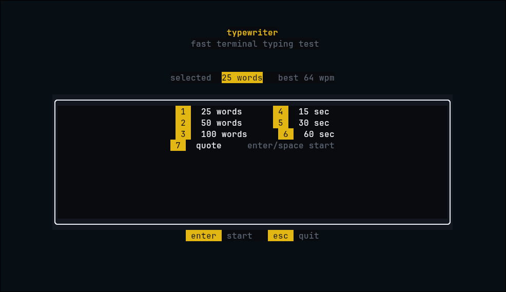

<p align="center">
  <p align="center">
    
  </p>
  <h1 align="center">typewriter</h1>
  <p align="center">
    A fast, polished terminal typing test built in Rust.
  </p>
</p>

<p align="center">
  
  
  
  
</p>

<p align="center">
  
  
  
  
</p>

## Overview

`typewriter` is a lightweight command-line typing test focused on low input latency, clean terminal rendering, and practical typing metrics. It uses `ratatui` for the interface, `crossterm` for terminal events, and a small `std::sync::mpsc` event loop for responsive keyboard input and smooth 60fps UI updates.

## Features

- Words, timed, and quote typing modes
- Per-character highlighting for correct, incorrect, untyped, and cursor states
- Centered, dynamically wrapped typing area
- Live WPM, accuracy, and timer display
- Results view with WPM, raw WPM, accuracy, consistency, and character breakdown
- WPM sample bar chart using `ratatui`
- Configurable themes and behavior
- Local TOML config and JSON score persistence
- No async runtime dependency

## Install

Install from this repository:

```bash
cargo install --path .
```

Run from source:

```bash
cargo run
```

## Usage

```bash
typewriter
typewriter --mode words --words 50
typewriter --mode time --time 60
typewriter --mode quote
```

From source:

```bash
cargo run -- --mode words --words 50
cargo run -- --mode time --time 60
cargo run -- --mode quote
```

## Configuration

On first run, `typewriter` creates:

```text
~/.config/typewriter/config.toml
~/.config/typewriter/scores.json
```

Default config:

```toml
[test]
default_mode = "words"
word_count = 25
duration = 30

[theme]
name = "dark"
accent = "#e2b714"

[behavior]
show_live_wpm = true
smooth_caret = true
stop_on_error = false
```

Available themes:

- `dark`
- `light`
- `catppuccin-mocha`
- `nord`
- `dracula`

## Keybinds

### Home

| Key | Action |
| --- | --- |
| `1` / `2` / `3` | Select 25, 50, or 100 words |
| `4` / `5` / `6` | Select 15, 30, or 60 seconds |
| `7` | Select quote mode |
| `Enter` / `Space` | Start test |
| `Esc` | Quit |

### Test

| Key | Action |
| --- | --- |
| Any character | Start timer and type |
| `Backspace` | Edit current word |
| `Space` | Advance word |
| `Ctrl+R` | Restart test |
| `Esc` | Return home |
| `Ctrl+C` | Quit |

### Results

| Key | Action |
| --- | --- |
| `Tab` | Retry same config |
| `Enter` | Start new test |
| `Esc` | Return home |

## Project Layout

```text
typewriter/
├── assets/
│   └── words/
│       ├── english_200.txt
│       └── english_1000.txt
├── src/
│   ├── app.rs
│   ├── config.rs
│   ├── events.rs
│   ├── main.rs
│   ├── engine/
│   │   ├── stats.rs
│   │   ├── timer.rs
│   │   └── words.rs
│   └── ui/
│       ├── theme.rs
│       └── screens/
│           ├── home.rs
│           ├── test.rs
│           └── results.rs
└── Cargo.toml
```

## Development

```bash
cargo fmt --check
cargo check
cargo test
cargo clippy -- -D warnings
cargo build
```

## License

MIT
